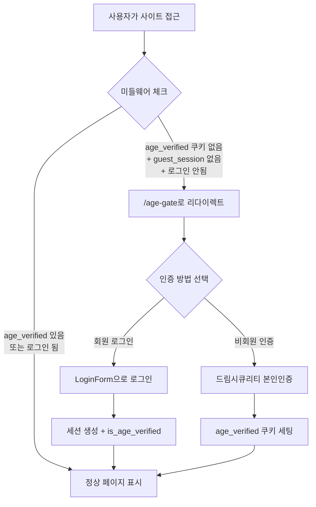

# 🔐 1.1 성인인증 게이트 (`/age-gate`) 상세 테스트 가이드

> 실제 코드 분석 기반으로 작성된 단계별 테스트 방법입니다.

---

## 관련 코드 파일

| 파일 | 역할 |
|------|------|
| [middleware.ts](file:///d:/Antigravity/Foxmon/middleware.ts) | 쿠키 검사 → `/age-gate` 리다이렉트 로직 |
| [age-gate/page.tsx](file:///d:/Antigravity/Foxmon/app/(auth)/age-gate/page.tsx) | 성인인증 페이지 (회원 로그인 + 비회원 인증) |
| [AgeVerificationBox.tsx](file:///d:/Antigravity/Foxmon/src/components/auth/AgeVerificationBox.tsx) | 드림시큐리티 본인인증 컴포넌트 |
| [age-gate-facade.tsx](file:///d:/Antigravity/Foxmon/components/home/age-gate-facade.tsx) | 비회원용 파사드 페이지 (약관/요금표 노출) |

---

## 인증 흐름 구조



---

## 테스트 #1: 미인증 사용자 접근 차단

### 🎯 검증 포인트
미들웨어가 `age_verified` 쿠키와 `foxmon_guest_session` 쿠키가 없는 사용자를 `/age-gate`로 정확히 리다이렉트하는지 확인

### 📋 단계별 테스트 방법

**사전 조건**: 모든 Foxmon 관련 쿠키가 없는 상태

#### Step 1. 시크릿 모드 열기
```
Chrome: Ctrl + Shift + N
Edge: Ctrl + Shift + N
Firefox: Ctrl + Shift + P
```

#### Step 2. DevTools 열기
```
F12 → Network 탭 선택 → "Preserve log" 체크
```

#### Step 3. 내부 페이지 직접 접근 시도
아래 URL들을 주소창에 **직접 입력**하여 각각 테스트:

| 테스트 URL | 예상 결과 |
|-----------|---------|
| `http://localhost:3000/jobs` | → `/age-gate`로 리다이렉트 |
| `http://localhost:3000/community` | → `/age-gate`로 리다이렉트 |
| `http://localhost:3000/mypage/settings` | → `/login?message=login_required`로 리다이렉트 (로그인 필요) |
| `http://localhost:3000/biz` | → `/login?message=login_required`로 리다이렉트 |
| `http://localhost:3000/seekers` | → `/age-gate`로 리다이렉트 |

#### Step 4. Network 탭에서 확인
- **Status**: `307` (Temporary Redirect)
- **Location 헤더**: `/age-gate` 또는 `/login?message=login_required`

#### Step 5. 예외 경로 테스트 (리다이렉트 되면 안 되는 경로)

| 테스트 URL | 예상 결과 |
|-----------|---------|
| `http://localhost:3000/` (홈) | ✅ 정상 접근 (홈은 예외) |
| `http://localhost:3000/login` | ✅ 정상 접근 |
| `http://localhost:3000/register` | ✅ 정상 접근 |
| `http://localhost:3000/cs` | ✅ 정상 접근 (CS 터미널 예외) |
| `http://localhost:3000/sitemap.xml` | ✅ 정상 접근 (SEO 경로) |
| `http://localhost:3000/k/키워드` | ✅ 정상 접근 (SEO 경로) |
| `http://localhost:3000/render-banners` | ✅ 정상 접근 (배너 렌더링) |
| `http://localhost:3000/find-account` | ✅ 정상 접근 |
| `http://localhost:3000/reset-password/token123` | ✅ 정상 접근 |

### ✅ 기대 결과
- 보호된 페이지 → `/age-gate` 또는 `/login` 리다이렉트 **발생**
- 예외 경로 → 리다이렉트 **없이** 정상 표시

### 🔧 실패 시 확인 포인트
- [middleware.ts L93-96](file:///d:/Antigravity/Foxmon/middleware.ts#L93-L96): `isAgeVerified` 조건 분기 확인
- [middleware.ts L87-91](file:///d:/Antigravity/Foxmon/middleware.ts#L87-L91): 로그인 필요 리다이렉트 조건 확인

---

## 테스트 #2: 성인인증 통과 (비회원)

### 🎯 검증 포인트
드림시큐리티 본인인증 → `age_verified` 쿠키 세팅 → 원래 페이지 이동 정상 작동 확인

### 📋 단계별 테스트 방법

> [!NOTE]
> `localhost` 환경에서는 자동으로 **Mock(테스트) 모드**가 활성화됩니다.
> 실제 드림시큐리티 인증 없이 테스트가 가능합니다.

#### Step 1. 개발 서버 실행
```bash
npm run dev
```

#### Step 2. 시크릿 모드에서 접근
```
http://localhost:3000/jobs
```
→ `/age-gate`로 자동 리다이렉트됨

#### Step 3. 성인인증 페이지 확인
페이지가 두 영역으로 나뉘어 표시됨:
- **왼쪽**: 🔒 회원 서비스 (로그인 폼)
- **오른쪽**: ℹ️ 비회원 인증 입장 (본인인증 버튼)

#### Step 4. 비회원 인증 실행
1. 오른쪽 영역의 **"📱 휴대폰 본인 인증"** 버튼 클릭
2. localhost이므로 아래 메시지가 표시됨:
   ```
   ⚙️ 개발자 테스트 모드: 모의(Mock) 본인인증이 진행됩니다.
   ```
3. Mock 인증이 자동 진행됨 (약 1초 소요)

#### Step 5. DevTools로 쿠키 확인
```
F12 → Application 탭 → Cookies → localhost
```

확인할 쿠키:
| 쿠키 이름 | 값 | 비고 |
|----------|---|------|
| `age_verified` | `true` | 성인인증 완료 표시 |
| `guest_gender` | `MALE` 또는 `FEMALE` | 성별 정보 (Mock은 MALE) |
| `foxmon_guest_session` | `{...json...}` | 게스트 세션 (서버에서 세팅) |

#### Step 6. 페이지 이동 확인
인증 성공 후 **`/` (홈페이지)**로 자동 이동되는지 확인

#### Step 7. 인증 후 내부 페이지 접근 재테스트
```
http://localhost:3000/jobs
http://localhost:3000/seekers
http://localhost:3000/community
```
→ 이제 모두 **정상 접근** 가능해야 함

### ✅ 기대 결과
- Mock 인증 1초 후 성공 메시지
- `age_verified=true` 쿠키 세팅
- 홈으로 자동 이동
- 이후 보호된 페이지 정상 접근 가능

### 🔧 실패 시 확인 포인트
- [AgeVerificationBox.tsx L29-36](file:///d:/Antigravity/Foxmon/src/components/auth/AgeVerificationBox.tsx#L29-L36): `isTestMode` 판단 로직
- [AgeVerificationBox.tsx L140-151](file:///d:/Antigravity/Foxmon/src/components/auth/AgeVerificationBox.tsx#L140-L151): Mock 인증 실행 로직
- [AgeVerificationBox.tsx L105-121](file:///d:/Antigravity/Foxmon/src/components/auth/AgeVerificationBox.tsx#L105-L121): 인증 성공 후 쿠키 세팅
- [age-gate/page.tsx L16-18](file:///d:/Antigravity/Foxmon/app/(auth)/age-gate/page.tsx#L16-L18): `handleVerifySuccess` → 쿠키 세팅 + 홈 이동

---

## 테스트 #3: 이미 인증된 사용자가 `/age-gate` 재접근

### 🎯 검증 포인트
이미 인증 완료된 사용자가 `/age-gate`에 다시 접근하면, 불필요하게 인증 페이지를 보지 않고 자동 리다이렉트되는지 확인

### 📋 단계별 테스트 방법

#### Step 1. 인증 완료 상태 만들기

**방법 A) 수동 쿠키 주입** (가장 빠름):
```
F12 → Console 탭에서 아래 입력:
```
```javascript
document.cookie = "age_verified=true; path=/; SameSite=Lax";
document.cookie = "foxmon_guest_session=test123; path=/; SameSite=Lax";
```

**방법 B)** 테스트 #2의 Mock 인증을 먼저 완료

#### Step 2. `/age-gate` 접근 시도
주소창에 직접 입력:
```
http://localhost:3000/age-gate
```

#### Step 3. 리다이렉트 확인

| 사용자 상태 | 기대 결과 | 근거 코드 |
|-----------|---------|---------|
| 로그인 + 인증 완료 | → `/` (홈)으로 리다이렉트 | middleware.ts L101 |
| 비로그인 + 인증 완료 | → `/register`로 리다이렉트 | middleware.ts L101 |

#### Step 4. Network 탭에서 확인
- **Status**: `307`
- **Location**: `/` 또는 `/register`

### ✅ 기대 결과
- 로그인된 사용자 → **홈(`/`)**으로 이동
- 비로그인 사용자 → **회원가입(`/register`)**으로 이동
- `/age-gate` 페이지가 **표시되지 않음**

### 🔧 실패 시 확인 포인트
- [middleware.ts L98-103](file:///d:/Antigravity/Foxmon/middleware.ts#L98-L103):
```typescript
// 3. Already Verified handling: Don't show age-gate if already verified
if (isAgeVerified && isAgeGatePage) {
    const redirectTo = session?.user ? '/' : '/register';
    return NextResponse.redirect(new URL(redirectTo, nextUrl));
}
```

---

## 테스트 #4: 미성년자 차단

### 🎯 검증 포인트
만 19세 미만 생년월일이 인증 결과로 반환될 때, 접근이 차단되고 차단 메시지가 표시되는지 확인

### 📋 단계별 테스트 방법

> [!IMPORTANT]
> 미성년자 차단 로직은 **서버 사이드(`/api/auth/kmc` API)**에서 생년월일을 검증합니다.
> localhost Mock 모드에서는 기본적으로 성인으로 통과하므로, **API 레벨에서 테스트**해야 합니다.

#### 방법 A: API 직접 호출로 테스트

```bash
# DevTools Console에서 실행
fetch('/api/auth/kmc', {
  method: 'POST',
  headers: { 'Content-Type': 'application/json' },
  body: JSON.stringify({
    action: 'confirm',
    isMock: true,
    encryptMOKKeyToken: 'MOCK_MINOR_TEST',
    // 서버에서 Mock 모드일 때 미성년자 데이터를 반환하도록 구성되어 있는지 확인
  })
}).then(r => r.json()).then(console.log);
```

#### 방법 B: UI에서 차단 메시지 확인

미성년자 차단 시 AgeVerificationBox 컴포넌트가 표시하는 UI:

1. 인증 결과에서 `19세 미만`이 포함된 메시지가 반환되면
2. `blockedMessage` state가 세팅됨
3. 아래와 같은 차단 화면이 표시됨:

```
┌──────────────────────────────────┐
│            🔴 19                 │
│                                  │
│     접속이 제한되었습니다           │
│                                  │
│  만 19세 미만은 이 서비스를        │
│  이용할 수 없습니다.               │
│                                  │
│  청소년 보호법에 의거하여          │
│  만 19세 미만은 본 서비스를        │
│  이용할 수 없습니다.               │
└──────────────────────────────────┘
```

#### 방법 C: 컴포넌트 state 강제 주입으로 UI 테스트

DevTools Console에서 React DevTools 활용:
1. `F12` → **Components** 탭 (React DevTools 확장 필요)
2. `AgeVerificationBoxContent` 컴포넌트 검색
3. `blockedMessage` state를 수동으로 변경:
```
"만 19세 미만은 이용할 수 없습니다. 생년월일: 2010-01-15"
```
4. 차단 UI가 정상 렌더링되는지 확인

### ✅ 기대 결과
- 인증 결과에 `19세 미만` 키워드 포함 시 → 빨간색 차단 화면 표시
- `age_verified` 쿠키 **세팅되지 않음**
- 홈으로 이동 **불가**
- 인증 버튼이 사라지고 차단 메시지만 표시

### 🔧 실패 시 확인 포인트
- [AgeVerificationBox.tsx L123-129](file:///d:/Antigravity/Foxmon/src/components/auth/AgeVerificationBox.tsx#L123-L129): 미성년자 메시지 판단 로직
```typescript
if (msg.includes('19세 미만')) {
    setBlockedMessage(msg);
} else {
    alert(msg);
}
```
- [AgeVerificationBox.tsx L203-215](file:///d:/Antigravity/Foxmon/src/components/auth/AgeVerificationBox.tsx#L203-L215): 차단 UI 렌더링 코드

---

## 🧰 테스트 유틸리티 명령어 모음

### 쿠키 초기화 (시크릿 모드 대신 사용)
```javascript
// DevTools Console에서 실행
document.cookie = "age_verified=; path=/; max-age=0";
document.cookie = "foxmon_guest_session=; path=/; max-age=0";
document.cookie = "guest_gender=; path=/; max-age=0";
location.reload();
```

### 현재 쿠키 상태 확인
```javascript
// DevTools Console에서 실행
console.table(
  document.cookie.split(';').map(c => {
    const [name, ...val] = c.trim().split('=');
    return { name, value: val.join('=') };
  })
);
```

### 강제 성인인증 상태 만들기
```javascript
document.cookie = "age_verified=true; path=/; SameSite=Lax";
document.cookie = "foxmon_guest_session=manual_test; path=/; SameSite=Lax";
```

### Mock 모드 강제 활성화 (프로덕션 환경에서)
URL 파라미터 추가:
```
https://foxmon.co.kr/age-gate?test=1
https://foxmon.co.kr/age-gate?mock=1
https://foxmon.co.kr/age-gate?bypass=1
```

> [!WARNING]
> `?test=1`, `?mock=1`, `?bypass=1` 파라미터는 **프로덕션에서도 Mock 인증을 활성화**합니다.
> 오픈 전 이 파라미터를 비활성화하거나 환경변수로 제어하는 것을 **강력히 권장**합니다.
> 관련 코드: [AgeVerificationBox.tsx L32-34](file:///d:/Antigravity/Foxmon/src/components/auth/AgeVerificationBox.tsx#L32-L34)
